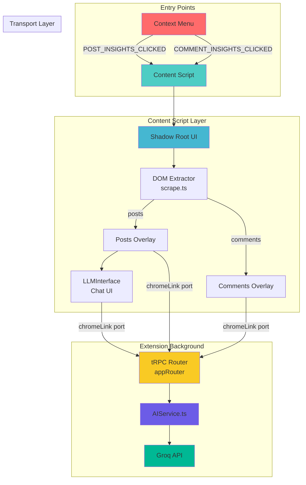
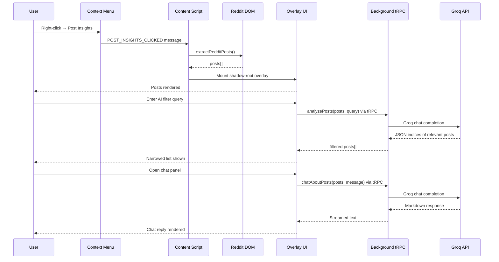
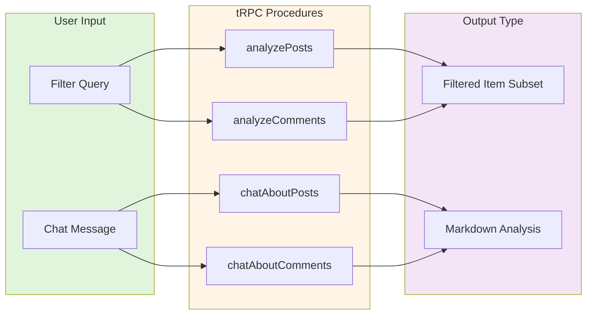
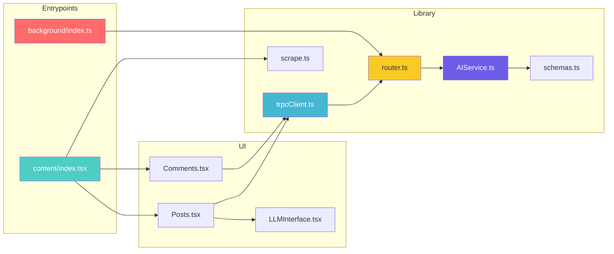

# Reddix - AI-Powered Reddit Insights Extension

<p align="center">
  
</p>

[](https://www.typescriptlang.org/)
[](https://react.dev/)
[](https://wxt.dev/)
[](https://groq.com/)

> A browser extension that turns chaotic Reddit browsing into a focused insights workflow — with AI-powered filtering, local search, and a chat interface, all inside a polished shadow-root overlay.

---

## Table of Contents

- [Overview](#overview)
- [Showcase](#showcase)
- [System Architecture](#system-architecture)
- [Key Features](#key-features)
- [Pipeline Flow](#pipeline-flow)
- [AI Capabilities](#ai-capabilities)
- [Installation & Development](#installation--development)
- [Configuration](#configuration)
- [Usage](#usage)
- [Project Structure](#project-structure)
- [Tech Stack](#tech-stack)
- [Roadmap](#roadmap)
- [Security Notes](#security-notes)
- [License](#license)

---

## Overview

**Reddix** is a Chrome extension that injects an intelligent overlay into Reddit pages, letting you extract, search, filter, and chat with posts and comments — without ever leaving the page.

### What Makes It Special?

- **Shadow-Root Overlay**: Non-intrusive, scoped UI injected directly into the Reddit page
- **tRPC over Chrome Messaging**: Type-safe RPC between content scripts and background worker
- **AI Filtering**: Groq-powered relevance ranking — surface only what matters
- **AI Chat Interface**: Ask questions about posts/comments and get structured Markdown responses
- **Dual Insight Modes**: Separate workflows for posts and comments, both accessible via context menu
- **Local Search**: Instant client-side search with no round-trips

---

## Showcase

[Reddix-ShowCase](https://github.com/user-attachments/assets/67da9c2d-d520-49ee-a6f4-1f264764a00f)

---

## System Architecture



---

## Key Features

### Shadow-Root Overlay

- **Scoped Styles**: Completely isolated from Reddit's CSS via shadow DOM
- **Toggle Behavior**: Right-click → action mounts/unmounts the overlay in-place
- **No Page Reload**: Overlay attaches and detaches without disturbing the page

### DOM Extraction

- **Post Extraction**: Scrapes `shreddit-post` elements — title, subreddit, author, score
- **Comment Extraction**: Scrapes `shreddit-comment` elements — body, author, flair, subreddit
- **Resilient Selectors**: Handles Reddit's custom element architecture

### Local Search

- **Instant Filtering**: Client-side search with no latency
- **Multi-field**: Searches across title, subreddit, author (posts) and body, flair (comments)
- **Zero Network**: Runs entirely in the content script

### AI-Powered Filtering

- **Relevance Ranking**: Send a natural-language query; the model returns only matching items
- **JSON Index Mapping**: Model outputs indices, which are mapped back to original DOM data
- **Inline UX**: Activates via bot icon in the overlay — no new tabs or popups

### AI Chat Interface

- **Contextual Q&A**: Ask questions about the currently visible posts
- **Markdown Responses**: Structured output with bullet points and line-by-line formatting
- **Background Execution**: LLM calls happen in the background script — content scripts never touch the API directly

---

## Pipeline Flow



---

## AI Capabilities

Reddix supports two distinct AI interaction modes:



### Mode 1 — AI Filtering

| Property   | Detail                                                       |
| ---------- | ------------------------------------------------------------ |
| Procedures | `analyzePosts`, `analyzeComments`                            |
| Input      | Full posts/comments array + user query                       |
| Output     | JSON array of relevant indices                               |
| Behavior   | Indices mapped back to original items; list narrows in-place |

### Mode 2 — AI Chat

| Property   | Detail                                          |
| ---------- | ----------------------------------------------- |
| Procedures | `chatAboutPosts`, `chatAboutComments`           |
| Input      | Posts/comments context + conversational message |
| Output     | Markdown-formatted natural language             |
| Behavior   | Rendered line-by-line in the chat panel         |

> Prompts enforce strict output formatting so responses are always readable inside the overlay UI.

---

## Installation & Development

### Prerequisites

- Node.js (current LTS recommended)
- pnpm

### Setup

```bash
# Clone the repository
git clone <your-repo-url>
cd Reddix

# Install dependencies
pnpm install
```

### Development

```bash
# Chrome (default)
pnpm dev

# Firefox
pnpm dev:firefox
```

WXT will open the browser with the extension hot-reloaded on changes.

### Build & Package

```bash
# Production build
pnpm build

# Create distributable ZIP
pnpm zip

# Firefox build + ZIP
pnpm build:firefox
pnpm zip:firefox
```

---

## Configuration

### Extension Manifest

Configured in `wxt.config.ts` — adjust match patterns, permissions, and output paths here.

### Groq API Key

LLM calls are made in `src/lib/AIService.ts` using Groq's chat completions endpoint.

> **You will need a Groq API key.**
> Never hardcode or commit keys to the repository.

| Environment | Recommended Approach                     |
| ----------- | ---------------------------------------- |
| Local dev   | `.env` file with `GROQ_API_KEY=...`      |
| Production  | Extension settings UI + `chrome.storage` |

---

## Usage

### Context Menu Actions

After loading the extension in your browser:

- Right-click anywhere on a Reddit page → **Post Insights**
- Right-click anywhere on a Reddit page → **Comment Insights**

Each action toggles the overlay — triggering again unmounts it cleanly.

### Overlay Workflow

```
Open overlay
    │
    ├── Local search bar → instant filtering
    │
    ├── Bot icon → AI filter panel
    │       └── Enter query → list narrows to relevant items
    │
    └── Chat icon → AI chat panel
            └── Ask anything → Markdown response rendered inline
```

### Example Interaction

```
[User opens Post Insights on r/programming]

Overlay shows 34 posts

[User types in AI filter]: "posts about Rust performance"
→ Overlay narrows to 6 relevant posts

[User opens chat panel]: "Summarize the top concerns people have"
→ AI responds with a structured Markdown breakdown
```

---

## Project Structure

```
Reddix/
├── src/
│   ├── entrypoints/
│   │   ├── background/
│   │   │   └── index.ts                 # tRPC server + context menu setup
│   │   ├── content/
│   │   │   ├── index.tsx                # Message listener + overlay mounting
│   │   │   ├── posts/
│   │   │   │   └── Posts.tsx            # Posts overlay UI + AI filtering
│   │   │   ├── comments/
│   │   │   │   └── Comments.tsx         # Comments overlay UI + AI filtering
│   │   │   └── common/
│   │   │       └── LLMInterface.tsx     # AI chat panel component
│   │   ├── popup/
│   │   │   └── App.tsx                  # Extension popup (placeholder)
│   │   └── scripts/
│   │       └── scrape.ts                # DOM extractors for posts + comments
│   ├── lib/
│   │   ├── trpc/
│   │   │   ├── init.ts                  # tRPC initialization + context
│   │   │   ├── router.ts                # appRouter — all procedures
│   │   │   └── trpcClient.ts            # Singleton content-script client
│   │   ├── AIService.ts                 # Groq LLM calls + filtering logic
│   │   ├── schemas.ts                   # Zod schemas for all payloads
│   │   └── prompt.ts                    # Prompt templates + helpers
│   └── components/ui/                   # shadcn/ui + Radix primitives
├── wxt.config.ts
├── package.json
└── README.md
```

### Component Relationships



---

## Tech Stack

| Technology            | Role                                               |
| --------------------- | -------------------------------------------------- |
| **WXT**               | Extension framework — dev server, build, manifest  |
| **React 19**          | UI rendering inside shadow-root overlays           |
| **TypeScript**        | End-to-end type safety                             |
| **Tailwind CSS**      | Utility-first styling                              |
| **shadcn/ui + Radix** | Accessible UI primitives                           |
| **tRPC v10**          | Typed procedures across extension boundary         |
| **trpc-chrome**       | Chrome runtime messaging transport for tRPC        |
| **SuperJSON**         | Rich serialization over Chrome port                |
| **Zod**               | Runtime schema validation for all payloads         |
| **Axios**             | HTTP client for Groq API calls                     |
| **Groq**              | LLM provider — fast inference for filtering + chat |

---

## Technical Highlights

### tRPC Over Chrome Runtime

Content scripts never call the LLM directly. All AI procedures go through the background tRPC router via a long-lived Chrome port:

```ts
// content script — trpcClient.ts
const port = chrome.runtime.connect();
const client = createTRPCProxyClient<AppRouter>({
	transformer: superjson,
	links: [chromeLink({ port })],
});

// background — index.ts
createChromeHandler({
	router: appRouter,
	transformer: superjson,
	createContext: async () => ({}),
});
```

### Shadow-Root UI Injection

Overlays are scoped in shadow DOM to prevent style bleed with Reddit's CSS:

```ts
createShadowRootUi(ctx, {
	name: "post-insight-overlay",
	position: "inline",
	onMount: (uiContainer, _shadow, shadowContainer) => {
		// React renders into the shadow root — fully isolated
	},
});
```

### AI Filtering via Index Mapping

The model returns a lightweight JSON array of indices, which are mapped back to the already-extracted DOM data — no re-scraping needed:

```ts
// Model returns: [0, 3, 7, 12]
// Mapped back to original posts array → filtered subset
const filtered = indices.map((i) => posts[i]);
```

---

## Roadmap

- [ ] Comment chat UI (`chatAboutComments` + LLMInterface variant)
- [ ] Better Markdown rendering for chat responses (replace plain `<p>`)
- [ ] Settings page for user-provided Groq API key via `chrome.storage`
- [ ] Improved DOM extraction robustness across Reddit layout variants
- [ ] Rate limiting + request cancellation for in-flight AI queries
- [ ] Per-page caching of AI filter results
- [ ] Streamed AI responses for lower perceived latency

---

## Security Notes

- **Never hardcode API keys** — use `.env` for local dev and `chrome.storage` for production
- **Content scripts are untrusted** — all LLM calls are gated through the background script
- **DOM data is untrusted** — Zod schemas validate all scraped payloads before they reach tRPC procedures
- **Shadow DOM scoping** — overlay styles are fully isolated; no CSS leaks into or out of Reddit's page

---

## License

MIT — see [LICENSE](LICENSE).

---

<p align="center">
  <strong>Built with 🤍 by Suho Kim</strong>
</p>
